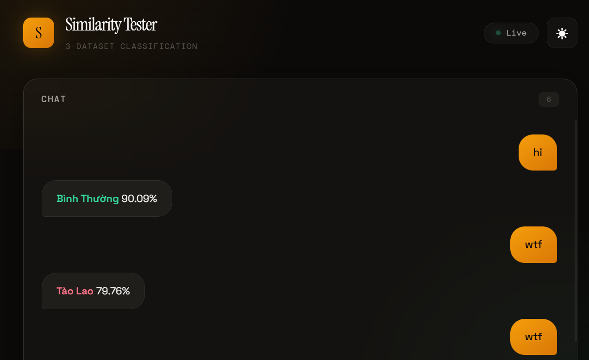

# SALE ANALYTICS - Semantic Router

## Instructions install

> - *Docker enpoints url*.
> - *Data source*.
> - *GPU or CPU*.
> - *Environment `uv`*

## Quick Test

```bash
# At root directory
uv run uvicorn visualization.app:app --reload
or
python -m uvicorn visualization.app:app --host 127.0.0.1 --port 8000 --reload
```

**RESULT**

<between>  </between>

---

Anh là **nhân viên sale cho thuê căn hộ dịch vụ** (serviced apartment), và anh muốn nắm rõ **chủ đề chính** của từng loại file JSONL để sau này dùng cho training AI, filter lead, hoặc xây chatbot xử lý khách hàng.

Dưới đây là phân tích chi tiết **chủ đề liên quan** của từng file, được thiết kế phù hợp với ngữ cảnh **bán căn hộ dịch vụ** (ngắn hạn/dài hạn, khách người Việt & nước ngoài, khu vực HCM):

### 1. **binh-thuong.jsonl**  

**Chủ đề chính:**
- Hỏi thông tin căn hộ (diện tích, số phòng ngủ, nội thất, view)
- Giá thuê, chi phí phát sinh (điện nước, internet, phí quản lý, gửi xe)
- Vị trí & tiện ích xung quanh (gần công ty, bệnh viện, siêu thị, metro, sân bay)
- Thời gian thuê (ngắn hạn 1-3 tháng hay dài hạn)
- Thủ tục thuê (cọc, hợp đồng, giấy tờ, check-in/check-out)
- Tiện ích căn hộ dịch vụ (máy giặt, bếp, máy lạnh, wifi tốc độ cao, hồ bơi, gym, an ninh 24/7)
- So sánh giá với các dự án khác
- Hỏi lịch xem nhà / hẹn lịch
- Yêu cầu ảnh/video thực tế, bản đồ, hợp đồng mẫu
- Khách hỏi về quy định chung cư (không hút thuốc, không thú cưng, giờ giấc…)

Khách này đều đặt cọc thành công và hỏi một cách bình thường, không có ý định ăn cắp dữ liệu (crawl data). Họ hỏi những câu rất cụ thể về giá cả, tiện ích, thủ tục thuê, hoặc yêu cầu xem nhà thật để quyết định thuê.

### 2. **crawl-data.jsonl**  

crawl-data.jsonl  
 
Chủ đề chính:
* Bài đăng TÌM PHÒNG (Nhu cầu từ khách): Đưa ra tài chính (budget), khu vực yêu cầu, tiện ích cần có (bếp, ban công), tệp khách (có nuôi pet, ở mấy người), thời gian dọn vào.
* Bài đăng PASS PHÒNG / Nhượng cọc: Lý do chuyển đi (về quê, chuyển công tác), thương lượng cọc (hỗ trợ 50% cọc), các ưu đãi kèm theo (tặng lại nội thất, đồ gia dụng).
* Bài đăng CHO THUÊ thực tế (Từ Sale/Chủ nhà): Mô tả chi tiết diện tích, loại phòng (studio, duplex, 1PN), giá cả, tiện ích, hình ảnh/video thực tế.
* Bóc phốt & Cảnh báo lừa đảo: Treo đầu dê bán thịt chó (đăng ảnh ảo), mập mờ chi phí ẩn, chủ nhà quỵt cọc, cò mồi ăn chặn, chung cư ồn ào/mất vệ sinh.
* Thảo luận Pháp lý & PCCC: Hỏi đáp về việc tòa nhà có đạt chuẩn PCCC không, có bị công an kiểm tra đột xuất không, thủ tục đăng ký tạm trú (KT3) hoặc TRC cho khách nước ngoài.
* Review & Chia sẻ kinh nghiệm: Đánh giá các khu vực hot (Thảo Điền, Phú Mỹ Hưng), kinh nghiệm đàm phán hợp đồng, so sánh căn hộ dịch vụ với chung cư thông thường.
* Tìm người ở ghép: Nhu cầu share phòng, chia sẻ chi phí, yêu cầu về nếp sống (sạch sẽ, giờ giấc tự do, không dẫn bạn về phòng).
* Comment tương tác trên mạng xã hội: Xin báo giá hàng loạt, hỏi xin ảnh mộc, hỏi còn phòng trống không, hoặc comment dạo để lấy data thị trường.

Tạo test case hội thoại chat giữa Customer và Sale (hoặc tương tác Post/Comment giả lập)

Ví dụ:

```plain
Customer: Text
Sale: Text
Customer: Text
Sale: Text
Customer: Text
Sale: Text
Customer: Text
Sale: Text
```
 
em phải hiểu đây là khách hàng nhắn tin với nhân viên.
 
Khách này hỏi nhưng cố ý ăn cắp dữ liệu (crawl data) để lấy thông tin về giá cả, tiện ích, thủ tục thuê mà không có ý định thuê thật. Họ thường hỏi những câu rất cụ thể về hợp đồng, chi phí ẩn, hoặc yêu cầu xem nhà nhưng không có ý định đến xem thật.

### 3. **tao-lao.jsonl**  

**Chủ đề chính (rất sát với 2 file anh đã tạo trước):**
- Tán tỉnh biến thái với sale (nữ): “Em xinh quá, anh thuê căn hộ để gặp em”, “Em mặc đồ sexy đi xem nhà với anh nha”
- Yêu cầu “dịch vụ đặc biệt” ngầm: gái gọi, massage, party, “căn hộ có thêm dịch vụ”, “cho phép dẫn bạn gái khác nhau”
- Hỏi về việc dùng căn hộ để “nhậu nhẹt, đánh bạc, hút chích”
- Tin nhắn tào lao kiểu: “Căn hộ có cho ở chung với 5-6 người không?”, “Có cho quay phim không?”, “Có camera trong phòng không?”
- Chửi bới, đòi giảm giá kiểu “anh là VIP, anh giới thiệu nhiều khách”
- Ngáo đá / say rượu nhắn linh tinh
- Hỏi giá kiểu “thuê 1 đêm được không”, “thuê giờ được không”
- Yêu cầu “giữ bí mật”, “không ghi tên thật”, “không check giấy tờ”
- Kết hợp tệ nạn: “Căn hộ yên tĩnh không, anh hay tổ chức tiệc”, “Có cho hút thuốc lá trong phòng không?”

## NEXT

Về mặt **chất lượng dữ liệu (Data Quality)** để huấn luyện AI, các file này đang gặp một số vấn đề khá nghiêm trọng có thể làm sai lệch kết quả dự đoán. Dưới đây là phân tích chi tiết và cách tối ưu:

### 1. Phân tích tình trạng hiện tại (Các file đã chuẩn chưa?)

**❌ Lỗi 1: Trùng lặp dữ liệu (Overfitting trong Top-K)**
Trong file `binh-thuong.jsonl`, có rất nhiều câu bị lặp lại y hệt nhau. 
* Ví dụ: Đoạn *"Sếp mình cần hóa đơn VAT để công ty quyết toán..."* bị lặp lại ở các ID 22, 23, 26, 31, 36. 
* Đoạn *"Em ơi, căn hộ bên đường Nguyễn Văn Trỗi còn phòng không..."* bị lặp ở các ID 25, 32, 58.
* **Hậu quả:** Khi tính Top-2 Similarity, nếu khách hỏi một câu hơi giống đoạn này, AI sẽ vớt ngay 2 câu trùng lặp này ra làm kết quả. Nó làm giảm sự đa dạng từ vựng và khiến AI bị "học vẹt".

**❌ Lỗi 2: Mất cân bằng tỷ lệ mẫu (Imbalanced Dataset)**
* `tao-lao.jsonl`: ~96 mẫu
* `binh-thuong.jsonl`: ~60 mẫu
* `crawl-data.jsonl`: ~18 mẫu
* **Hậu quả:** Điểm **Centroid** (Tâm cụm) sẽ bị kéo lệch mạnh về phía `tao_lao`. Vì tập `crawl_data` quá mỏng (chỉ có 18 câu), mô hình sẽ rất khó nhận diện chính xác nhãn này trừ khi khách dùng đúng y xì các từ khóa đã có.

**❌ Lỗi 3: Gán nhãn sai logic hành vi (Data Mislabeled)**
Trong file `crawl-data.jsonl` (ID 6, 7, 18), có xuất hiện câu: *"Gửi tui luôn cái hợp đồng mẫu với cái map xem chỗ đó khúc nào, xem có gài cắm gì khum"*. 
* **Hậu quả:** Việc khách hàng muốn xem hợp đồng mẫu trước khi quyết định thuê là một hành vi tìm hiểu hoàn toàn bình thường, không phải là dấu hiệu của việc cào dữ liệu (crawl data). Nếu giữ nguyên ở nhãn này, AI sẽ bắt nhầm khách thật thành đối thủ/bot. Cần chuyển các mẫu hỏi về "hợp đồng mẫu" sang `binh-thuong.jsonl`.

---

### 2. Cần tối ưu thêm gì nữa không?

Để hệ thống AI sắc bén và không bị bối rối, bạn cần thực hiện 3 bước làm sạch (Data Cleansing) sau:

* **Xóa sạch các dòng trùng lặp:** Mỗi file jsonl chỉ nên chứa các mẫu câu độc nhất (Unique).
* **Chuẩn hóa tiền tố:** Trong file có nhiều chỗ bị lặp chữ `"Customer: Customer:"` (ví dụ ID 20 đến 29 của file `crawl_data`). Cần xóa bớt chữ thừa để Vector Embedding tập trung vào nội dung chính, tránh việc AI phân tích nhầm chữ "Customer" làm từ khóa trọng tâm.
* **Tách ý rõ ràng:** Những đoạn quá dài nên được làm phong phú bằng cách tách thành các biến thể ngắn hơn (cách khách hàng thực tế hay chat từng câu cụt lủn).

---

### 3. Độ lớn các mẫu ở mỗi file là bao nhiêu thì đạt chuẩn?

Quy mô dữ liệu (Dataset Size) chia theo 3 giai đoạn như sau:

* **Mức tối thiểu (Để demo và test luồng): ~100 mẫu/nhãn.**
  * Hiện tại bạn cần bổ sung gấp cho tập `crawl_data` thêm khoảng 80 câu nữa để cân bằng với tập `tao_lao`. Tỷ lệ vàng ở giai đoạn này là 1:1:1.
* **Mức ổn định (Để dùng thực tế cho một dự án/khu vực): 500 - 1.000 mẫu/nhãn.**
  * Ở mức này, AI bắt đầu hiểu được "ngữ cảnh" và "từ đồng nghĩa" thay vì chỉ dựa vào từ khóa chính xác.
* **Mức xuất sắc (Production Scale - tự động hoàn toàn): Trên 5.000 mẫu/nhãn.**
  * Lúc này, bạn có thể tự tin áp dụng luật *Xác suất tích lũy > 95%* để hệ thống tự động bypass mà con người không cần phải review lại bất kỳ tin nhắn nào.

## Chạy docker

```bash
# 1. Tạo thư mục cho Python Mailer nếu chưa có
mkdir -p src/chatwoot_mailer

# 2. Chạy tất cả
docker-compose down -v --remove-orphans  # Dọn sạch nếu có lỗi cũ
docker-compose up -d

# 3. Đợi khởi tạo (2 phút cho lần đầu)
sleep 120

# 4. Kiểm tra tất cả container chạy chưa
docker ps

# 5. (Chỉ chạy 1 lần đầu) Tạo tài khoản admin mẫu
docker exec -it chatwoot_app bundle exec rails db:seed
```

Sau đó truy cập: **http://localhost:3000/app/auth/login**

**Tài khoản mặc định sau seed:**
- Email: `admin@example.com`
- Password: `Password1!`

Hoặc vào **http://localhost:3000/app/auth/signup** để tạo mới.

## Gửi mail cho Sale

1. Vào Chatwoot UI: http://localhost:3000
2. Settings → Agents → Add Agent
3. Email: `s8230201@gmail.com` → Tick "Send email invitation"
4. Sale sẽ nhận mail từ `lea26464@gmail.com` để đặt mật khẩu

**Paste log nếu vẫn lỗi!**

## *Copyright Notice*

```plain
MIT License  

Copyright (c) 2026 Vinh-Gogo  

Permission is hereby granted, free of charge, to any person obtaining a copy  
of this software and associated documentation files (the "Software"), to deal  
in the Software without restriction, including without limitation the rights  
to use, copy, modify, merge, publish, distribute, sublicense, and/or sell  
copies of the Software, and to permit persons to whom the Software is  
furnished to do so, subject to the following conditions:  

The above copyright notice and this permission notice shall be included in all  
copies or substantial portions of the Software.  

THE SOFTWARE IS PROVIDED "AS IS", WITHOUT WARRANTY OF ANY KIND, EXPRESS OR  
IMPLIED, INCLUDING BUT NOT LIMITED TO THE WARRANTIES OF MERCHANTABILITY,  
FITNESS FOR A PARTICULAR PURPOSE AND NONINFRINGEMENT. IN NO EVENT SHALL THE  
AUTHORS OR COPYRIGHT HOLDERS BE LIABLE FOR ANY CLAIM, DAMAGES OR OTHER  
LIABILITY, WHETHER IN AN ACTION OF CONTRACT, TORT OR OTHERWISE, ARISING FROM,  
OUT OF OR IN CONNECTION WITH THE SOFTWARE OR THE USE OR OTHER DEALINGS IN THE  
SOFTWARE.
```